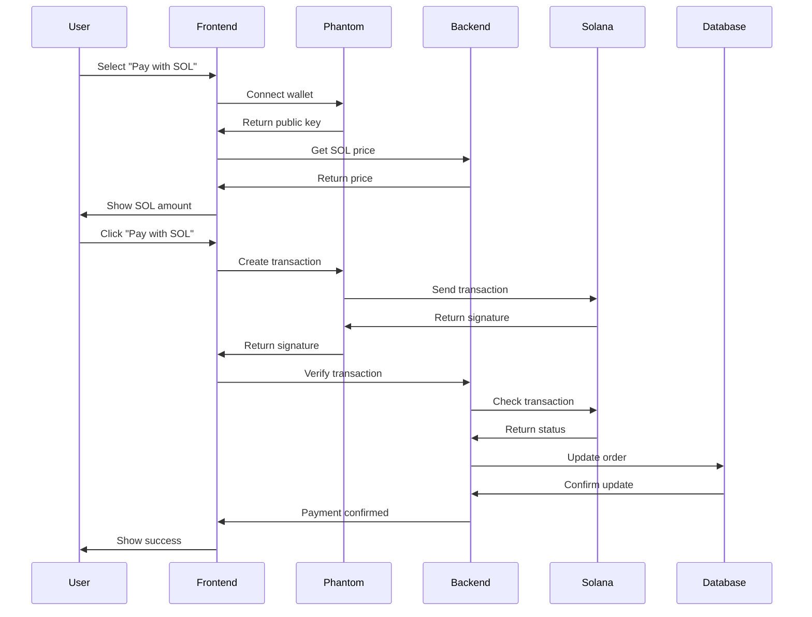

# E-FARM Solana Payment Integration Guide

This guide provides complete instructions for integrating Solana devnet payments into your E-FARM e-commerce website.

## 🚀 Quick Start

### 1. Backend Setup (Node.js)

1. **Navigate to the backend directory:**
   ```bash
   cd solana-backend
   ```

2. **Install dependencies:**
   ```bash
   npm install
   ```

3. **Configure environment variables:**
   ```bash
   cp env.example .env
   ```
   
   Edit `.env` file with your settings:
   ```env
   PORT=3000
   DB_HOST=127.0.0.1
   DB_USER=root
   DB_PASSWORD=
   DB_NAME=alb
   MERCHANT_WALLET_ADDRESS=YOUR_SOLANA_DEVNET_WALLET_ADDRESS
   ```

4. **Start the backend server:**
   ```bash
   npm start
   # or for development
   npm run dev
   ```

### 2. Frontend Integration

1. **Add Solana Web3.js to your HTML:**
   ```html
   <!-- Add these scripts to your payment page -->
   <script src="https://unpkg.com/@solana/web3.js@latest/lib/index.iife.min.js"></script>
   <script src="solana-payment.js"></script>
   ```

2. **Update your payment page:**
   - Copy the modified `sale.php` code (provided below)
   - The Solana payment option will automatically appear

## 📁 File Structure

```
E-FARM/
├── solana-payment.js              # Frontend Solana integration
├── solana-backend/                # Node.js backend
│   ├── server.js                  # Main server file
│   ├── package.json               # Dependencies
│   ├── env.example                # Environment template
│   └── services/                  # Backend services
│       ├── solanaService.js       # Solana blockchain operations
│       ├── priceService.js        # Price fetching from CoinGecko
│       ├── databaseService.js     # MySQL database operations
│       └── validationService.js   # Input validation
│   └── utils/
│       └── logger.js              # Logging utility
└── SOLANA_INTEGRATION_GUIDE.md    # This guide
```

## 🔧 Configuration

### Backend Configuration

Create a `.env` file in the `solana-backend` directory:

```env
# Server Configuration
PORT=3000
NODE_ENV=development

# Database Configuration (same as your PHP setup)
DB_HOST=127.0.0.1
DB_USER=root
DB_PASSWORD=
DB_NAME=alb
DB_PORT=3306

# Solana Configuration
SOLANA_NETWORK=devnet
SOLANA_RPC_URL=https://api.devnet.solana.com
MERCHANT_WALLET_ADDRESS=YOUR_MERCHANT_WALLET_ADDRESS_HERE

# Security
JWT_SECRET=your_jwt_secret_key_here
API_KEY=your_api_key_here

# Rate Limiting
RATE_LIMIT_WINDOW_MS=900000
RATE_LIMIT_MAX_REQUESTS=100

# External APIs
COINGECKO_API_URL=https://api.coingecko.com/api/v3

# Logging
LOG_LEVEL=info
```

### Frontend Configuration

Update the configuration in `solana-payment.js`:

```javascript
// In the SolanaPayment constructor
this.merchantWallet = 'YOUR_MERCHANT_WALLET_ADDRESS'; // Replace with your devnet wallet
this.backendUrl = 'http://localhost:3000'; // Your Node.js backend URL
```

## 💰 Setting Up Your Solana Wallet

### 1. Create a Devnet Wallet

1. **Install Phantom Wallet:**
   - Visit [phantom.app](https://phantom.app)
   - Install the browser extension

2. **Create a new wallet:**
   - Open Phantom
   - Click "Create New Wallet"
   - Save your seed phrase securely

3. **Switch to Devnet:**
   - Go to Settings → Developer Settings
   - Change Network to "Devnet"

4. **Get Devnet SOL:**
   - Visit [Solana Faucet](https://faucet.solana.com)
   - Enter your wallet address
   - Request devnet SOL (free test tokens)

### 2. Get Your Wallet Address

1. In Phantom, click on your wallet address
2. Copy the address (starts with letters/numbers)
3. Use this as your `MERCHANT_WALLET_ADDRESS` in the backend

## 🔄 Payment Flow

### 1. User Experience

1. User selects "Pay with SOL" option
2. Clicks "Connect Phantom Wallet"
3. Approves connection in Phantom
4. System fetches current SOL price
5. Shows amount to pay in SOL
6. User clicks "Pay with SOL"
7. Approves transaction in Phantom
8. System verifies transaction
9. Order status updated to "Paid"

### 2. Technical Flow



## 🛠️ API Endpoints

### Backend API Endpoints

| Endpoint | Method | Description |
|----------|--------|-------------|
| `/health` | GET | Health check |
| `/api/sol-price` | GET | Get current SOL/USD price |
| `/api/verify-transaction` | POST | Verify transaction and update order |
| `/api/transaction-status/:signature` | GET | Get transaction status |
| `/api/orders/:orderId` | GET | Get order details |
| `/api/webhook/solana` | POST | Webhook for transaction notifications |

### Example API Calls

**Get SOL Price:**
```bash
curl http://localhost:3000/api/sol-price
```

**Verify Transaction:**
```bash
curl -X POST http://localhost:3000/api/verify-transaction \
  -H "Content-Type: application/json" \
  -d '{
    "signature": "transaction_signature_here",
    "orderId": "ORDER_123",
    "usdAmount": 100.00,
    "solAmount": 0.5,
    "timestamp": "2024-01-01T00:00:00.000Z"
  }'
```

## 🗄️ Database Schema

The system automatically creates a `payments` table to track Solana payments:

```sql
CREATE TABLE payments (
    id INT AUTO_INCREMENT PRIMARY KEY,
    order_id VARCHAR(255) NOT NULL,
    order_users_id INT,
    order_items_id INT,
    payment_method VARCHAR(50) NOT NULL,
    payment_status VARCHAR(50) NOT NULL,
    transaction_signature VARCHAR(255),
    sol_amount DECIMAL(20, 9),
    usd_amount DECIMAL(10, 2),
    payment_timestamp TIMESTAMP,
    created_at TIMESTAMP DEFAULT CURRENT_TIMESTAMP,
    updated_at TIMESTAMP DEFAULT CURRENT_TIMESTAMP ON UPDATE CURRENT_TIMESTAMP
);
```

## 🔒 Security Considerations

### 1. Environment Variables
- Never commit `.env` files to version control
- Use strong, unique API keys
- Rotate keys regularly

### 2. Rate Limiting
- Backend includes rate limiting (100 requests per 15 minutes)
- Adjust limits based on your needs

### 3. Input Validation
- All inputs are validated and sanitized
- Solana addresses and signatures are verified
- SQL injection protection via parameterized queries

### 4. Error Handling
- Comprehensive error logging
- No sensitive data in error messages
- Graceful fallbacks for API failures

## 🧪 Testing

### 1. Test with Devnet SOL

1. Get free devnet SOL from the faucet
2. Test small transactions first
3. Verify transactions appear in your wallet
4. Check order status updates

### 2. Test Scenarios

- ✅ Successful payment
- ✅ Insufficient balance
- ✅ Network errors
- ✅ Invalid transactions
- ✅ Wallet not connected

### 3. Monitoring

Check logs in the `solana-backend/logs/` directory for:
- Transaction verifications
- API requests
- Database operations
- Error messages

## 🚨 Troubleshooting

### Common Issues

**1. "Phantom wallet not detected"**
- Ensure Phantom extension is installed
- Refresh the page
- Check browser console for errors

**2. "Transaction verification failed"**
- Check if transaction is confirmed on Solana
- Verify merchant wallet address is correct
- Check backend logs for details

**3. "Database connection failed"**
- Verify MySQL is running
- Check database credentials in `.env`
- Ensure database exists

**4. "SOL price fetch failed"**
- Check internet connection
- Verify CoinGecko API is accessible
- Check backend logs for API errors

### Debug Mode

Enable debug logging by setting in `.env`:
```env
LOG_LEVEL=debug
```

## 📈 Production Deployment

### 1. Environment Setup

```env
NODE_ENV=production
PORT=3000
DB_HOST=your_production_db_host
DB_USER=your_production_db_user
DB_PASSWORD=your_secure_password
MERCHANT_WALLET_ADDRESS=your_production_wallet
```

### 2. Security Hardening

- Use HTTPS for all communications
- Set up proper CORS origins
- Use environment-specific API keys
- Enable database SSL connections
- Set up monitoring and alerting

### 3. Scaling Considerations

- Use a load balancer for multiple backend instances
- Implement database connection pooling
- Set up Redis for caching
- Use a CDN for static assets

## 🔄 Maintenance

### Regular Tasks

1. **Monitor logs** for errors and performance issues
2. **Update dependencies** regularly for security patches
3. **Backup database** regularly
4. **Monitor Solana network** status
5. **Check wallet balance** and top up if needed

### Updates

To update the system:
1. Pull latest code
2. Run `npm install` in backend directory
3. Restart backend server
4. Test payment flow

## 📞 Support

For issues or questions:
1. Check the logs first
2. Review this documentation
3. Test with devnet first
4. Check Solana network status

## 🎯 Next Steps

After successful integration:

1. **Test thoroughly** with devnet SOL
2. **Monitor performance** and logs
3. **Set up production** environment
4. **Train staff** on the new payment method
5. **Update documentation** for users

## 📋 Checklist

- [ ] Backend server running on port 3000
- [ ] Database connection working
- [ ] Phantom wallet installed and configured
- [ ] Devnet SOL obtained for testing
- [ ] Frontend integration complete
- [ ] Payment flow tested
- [ ] Error handling verified
- [ ] Logs monitoring set up
- [ ] Production environment ready
- [ ] Security measures implemented

---

**Congratulations!** You now have a fully functional Solana payment system integrated into your E-FARM website. Users can pay with SOL on the Solana devnet, and all transactions are automatically verified and recorded in your database.
